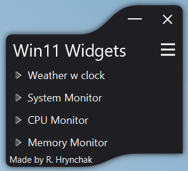
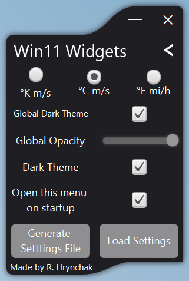
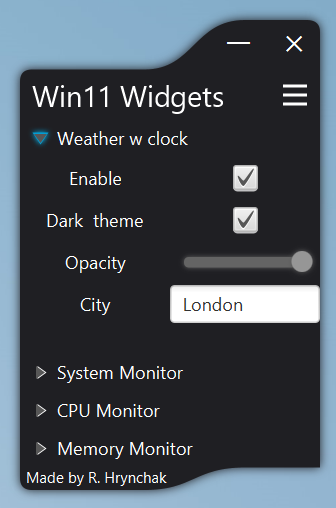
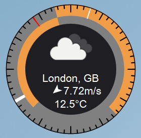
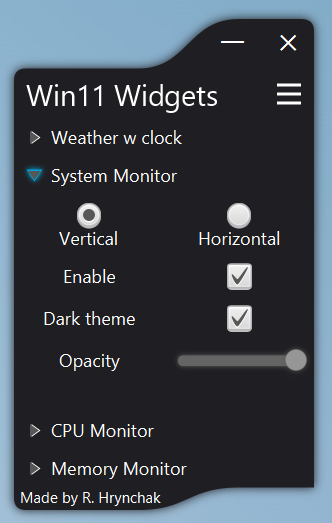
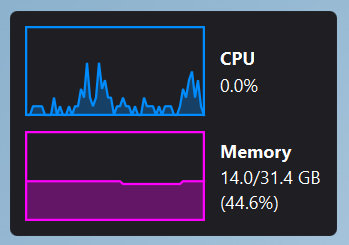
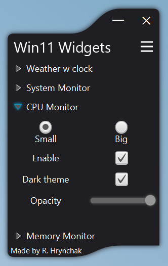
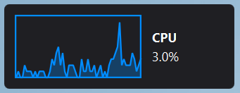
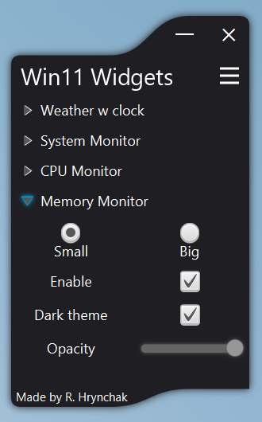
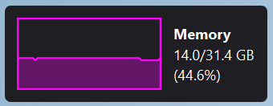

# Win11 Widgets

## Overview

Win11 Widgets is a simple and lightweight widget application designed as part of a coursework project. It provides
real-time monitoring and weather information for Windows 11.

## Features

- **Weather with Clock**: Displays weather data, including wind speed and temperature. The yellowish sectors on the
  clock represent the light time of the day, while the dark sectors represent nighttime.
- **System Monitor**: Tracks CPU and memory usage in real-time.
- **CPU Monitor**: Isolated CPU performance graph.
- **Memory Monitor**: Dedicated graph for memory usage statistics.
- **Customizable Settings**: Options to adjust theme, global opacity, and measurement units (e.g., °C, m/s, °F, mi/h).

## Settings

- Dark Theme.
- Opacity adjustment slider.
- Start menu on launch.
- Minimizing in tray.

## Screenshots

### Main Menu



### Settings Menu



### Weather Widget

<p align="center">


</p>

### CPU and Memory Monitor

<p align="center">


</p>

### CPU Monitor

<p align="center">


</p>

### Memory Monitor

<p align="center">


</p>

## Installation

1. Clone the repository:
   ```bash
   git clone https://github.com/I2oman/CourseworkWidgets.git
   ```
2. Install JRE (Java Runtime Environment) to ensure the application can run.
3. Run the application using the executable or command provided in the repository.
